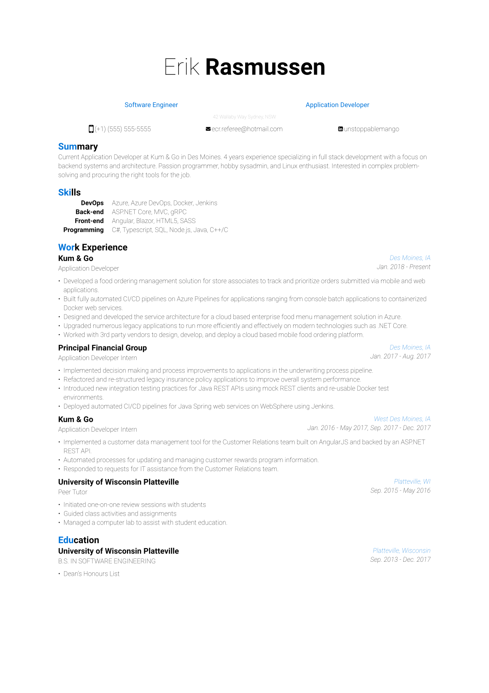

<!-- markdownlint-disable MD033 -->

# [Erik Rasmussen's](https://github.com/UnstoppableMango) Resume

This repository contains the [source code](./resume.typ) for my Resume.
Written in [Typst](https://github.com/typst/typst).
Over-engineered with [Cargo](https://doc.rust-lang.org/cargo/index.html) and [Make](https://www.gnu.org/software/make/).

  

## Development

TL;DR

- `make`: Generate all assets for $FORMATS
- `make update`: Refresh `./assets` directories
- `make .envrc`: Create a `.envrc` from [example.envrc](./hack/example.envrc)

### Pre-requisites

- [rustup](https://rustup.rs/)
- [fontist](https://github.com/fontist/fontist)

#### Useful

- [rbenv](https://github.com/rbenv/rbenv)
